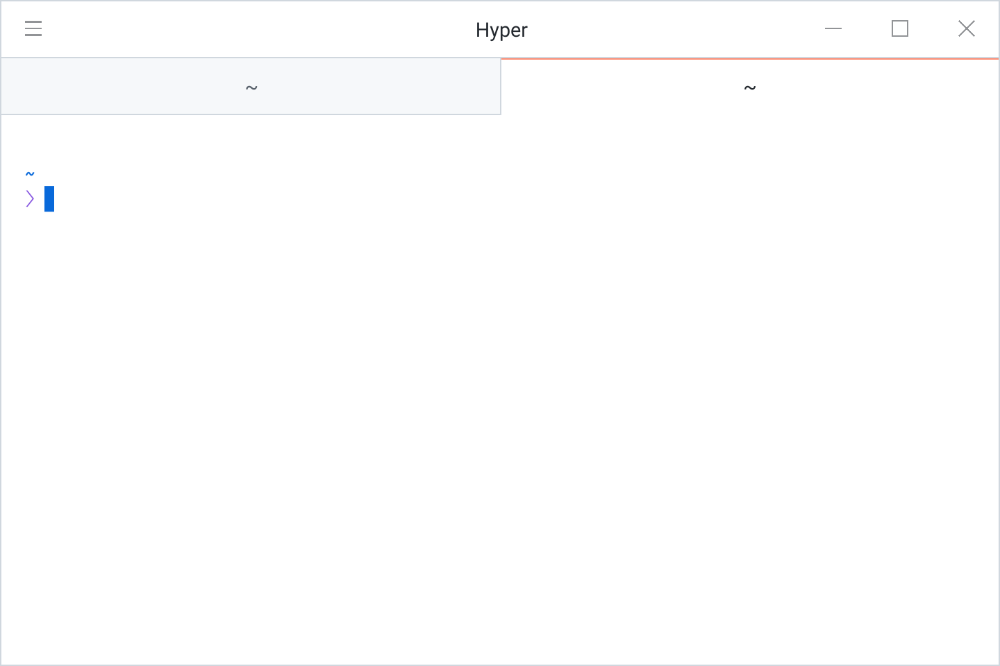
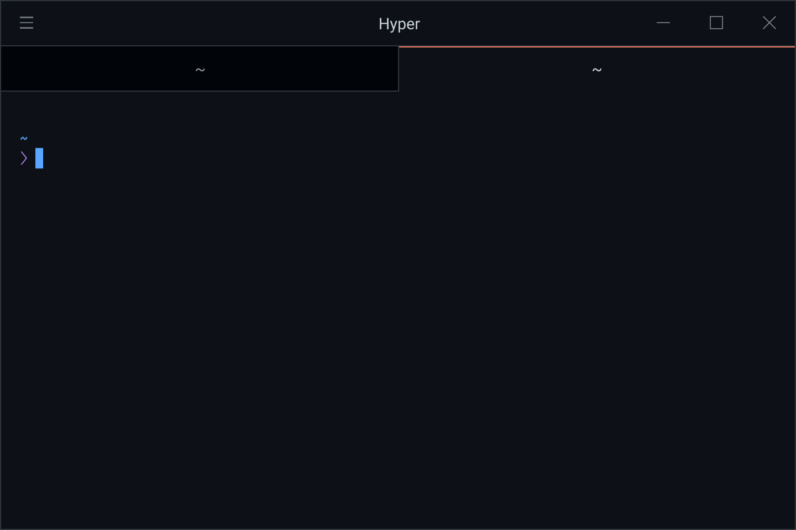

# Hyper GitHub Theme


| Light Theme                                  | Dark Theme                                  |
| -------------------------------------------- | ------------------------------------------- |
|  |  |

```js
module.exports = {
  config: {
    theme:
      "light" |
      "light-high-contrast" |
      "light-colorblind" |
      "light-tritanopia" |
      "dark" |
      "dark-high-contrast" |
      "dark-colorblind" |
      "dark-tritanopia" |
      "dark-dimmed",
  },
  plugins: ["hyper-theme-github"],
};
```
